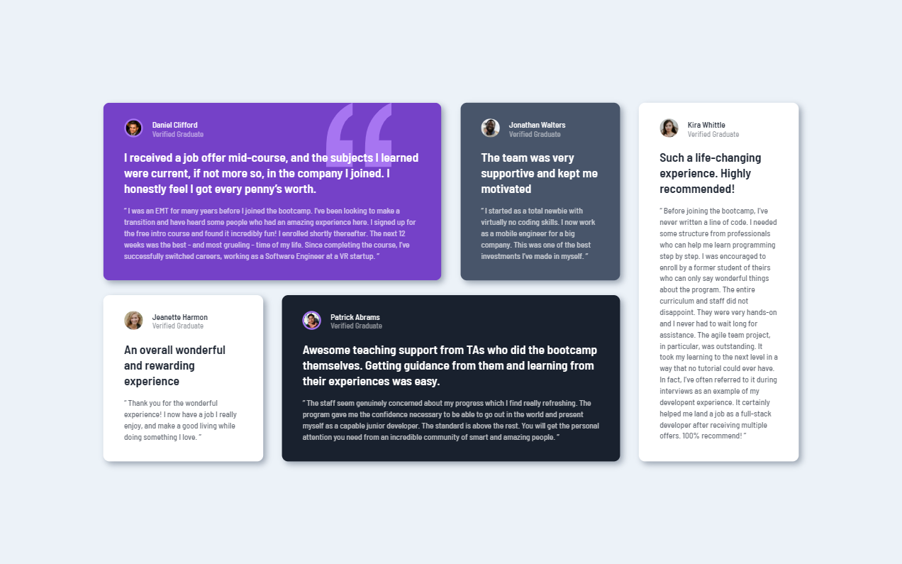

<h1 align="center">Testimonials grid section</h1>

[Live](https://damuzid.github.io/testimonials-grid-section/)
| [Solution](https://www.frontendmentor.io/solutions/responsive-layout-using-css-grid-tyst-jYnZ8)
| [Challenge](https://www.frontendmentor.io/challenges/testimonials-grid-section-Nnw6J7Un7)

Solution for a challenge from [frontendmentor.io](https://www.frontendmentor.io/)

## About The Project

This challenge will be perfect practice for anyone wanting to test their CSS Grid skills. Grid is such a powerful addition to CSS, so it's worth getting to grips with it! Your challenge is to build out this testimonials grid section and get it looking as close to the design as possible.

You can use any tools you like to help you complete the challenge. So if you've got something you'd like to practice, feel free to give it a go.

The optimal layout depending on the used device's screen size should be shown.

*This challenge was completed without access to the Figma design file.*

## Built with 

- Semantic HTML5 markup
- CSS Grid
- Desktop-first workflow
- Media query's

## What I learned

This was the second time using a CSS grid for me and with a more complex layout. It took some figuring out how to get everything lined up correctly but I'm happy with the end result.

## Useful resources

1. [Perfect Pixel](https://chrome.google.com/webstore/detail/perfectpixel-by-welldonec/dkaagdgjmgdmbnecmcefdhjekcoceebi) - Great Chrome(also available for other browsers) extension that helps to match the pixels of a design image.
3. [Debug CSS](https://chrome.google.com/webstore/detail/debug-css/igiofjnckcagmjgdoaakafngegecjnkj) - Another great Chrome(and other browsers) extension for a quick view of all your elements by outlining them.  
2. [MDN Web Docs](https://developer.mozilla.org/en-US/) - The Mozilla Web Docs are a treasure trove of infromation on CSS and more.
